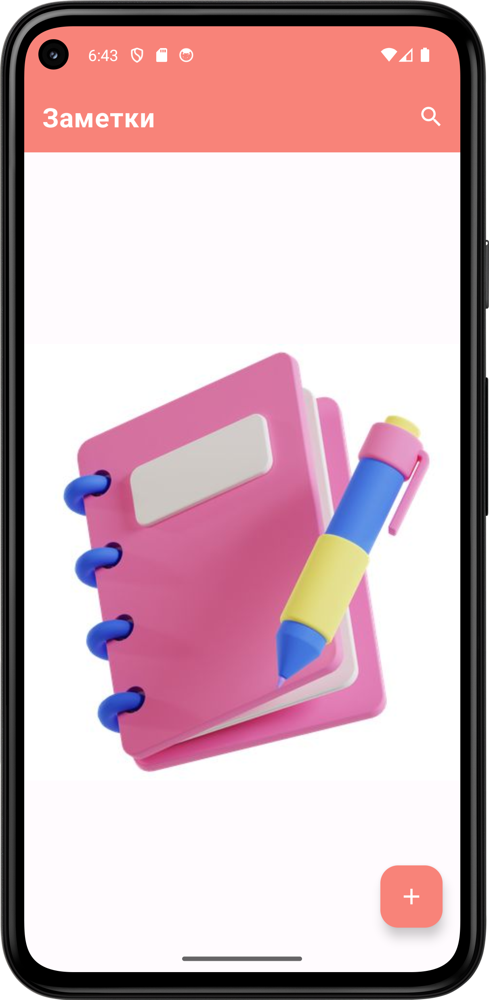
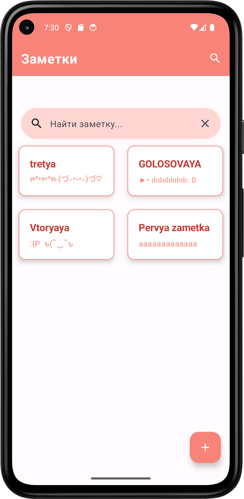
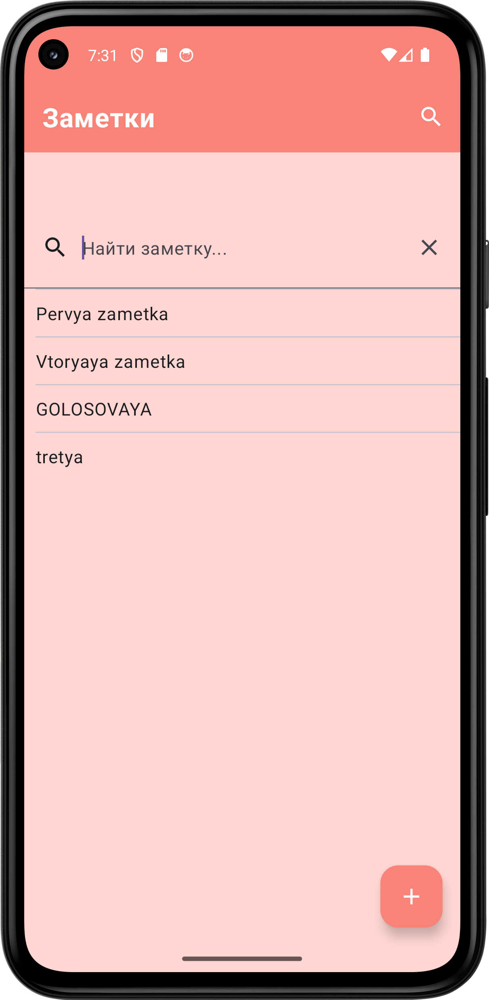
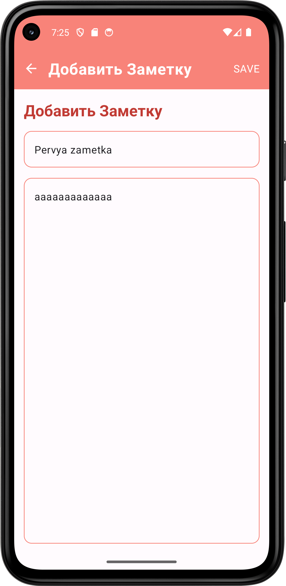
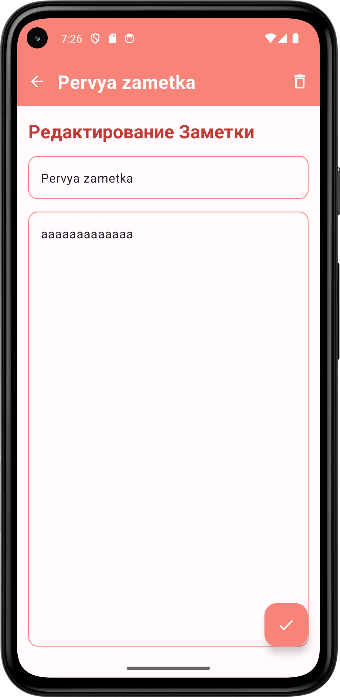

<h1>Notus</h1>
<strong>Приложение для заметок</strong>

    
    
    
    
    
  

- Tech stack
    - [Jetpack Compose](https://developer.android.com/jetpack/compose) - Android Ui
    - [Lifecycle Viewmodel](https://developer.android.com/topic/libraries/architecture/viewmodel) - Viewmodel
    - [Room](https://developer.android.com/training/data-storage/room) - Database
    - [Voyager](https://voyager.adriel.cafe/) - Navigation
